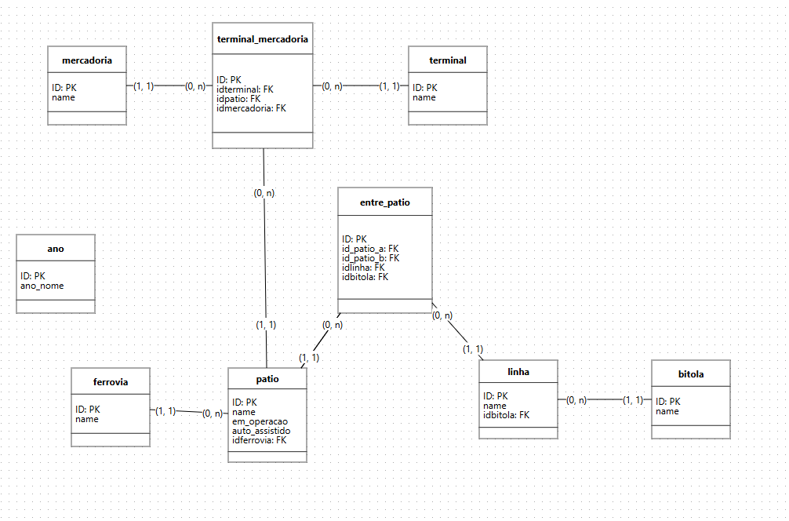

# Projeto Declaração de Rede Ferroviária - Painel Interativo

## Descrição
Este projeto apresenta um painel interativo desenvolvido com Streamlit para visualização de dados da Declaração de Rede (DR) da ANTT, contendo informações sobre infraestrutura ferroviária, pátios, terminais e mercadorias.

- O painel conta com gráficos que mostram insights sobre:

- Situação operacional dos pátios (em operação, auto assistidos)

- Tempo médio de carga e descarga por terminal

## Dados
Os dados foram extraídos diretamente do documento oficial da ANTT (Declaração de Rede 2025). Algumas tabelas possuíam dados incompletos ou vazios, o que impactou na criação de certos gráficos.

## Funcionalidades

- Visualização de situação operacional dos pátios em gráficos de pizza.

- Gráfico de barras interativo com filtros por terminal, mostrando tempos médios de carga e descarga.

## Como rodar o projeto
1. Clone este repositório:

```bash
git clone <url-do-repo>
cd <nome-do-repo>
```

2. Crie e ative um ambiente virtual Python (recomendado):

```bash
python -m venv .venv
.\.venv\Scripts\activate
```

3. Instale as dependências:

```bash
pip install -r requirements.txt
```

Execute o app:

```bash
streamlit run app.py
```

O painel será aberto no navegador, geralmente em http://localhost:8501

### Limitações

Alguns conjuntos de dados da Declaração de Rede estavam vazios ou incompletos, limitando a profundidade dos gráficos

### Modelagem do DB
